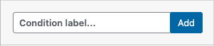
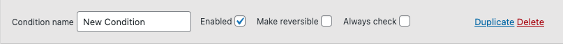
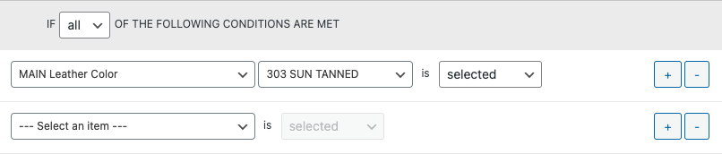
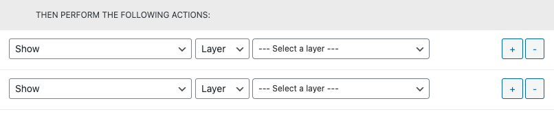
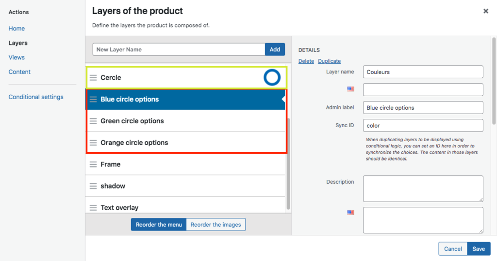
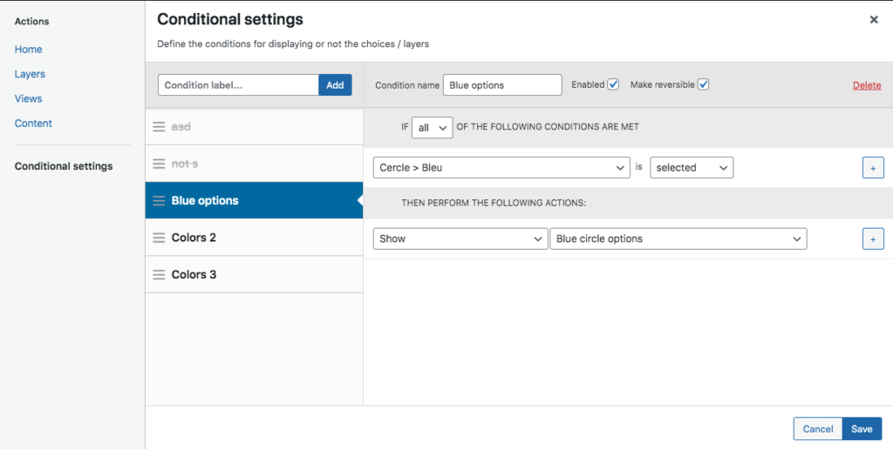
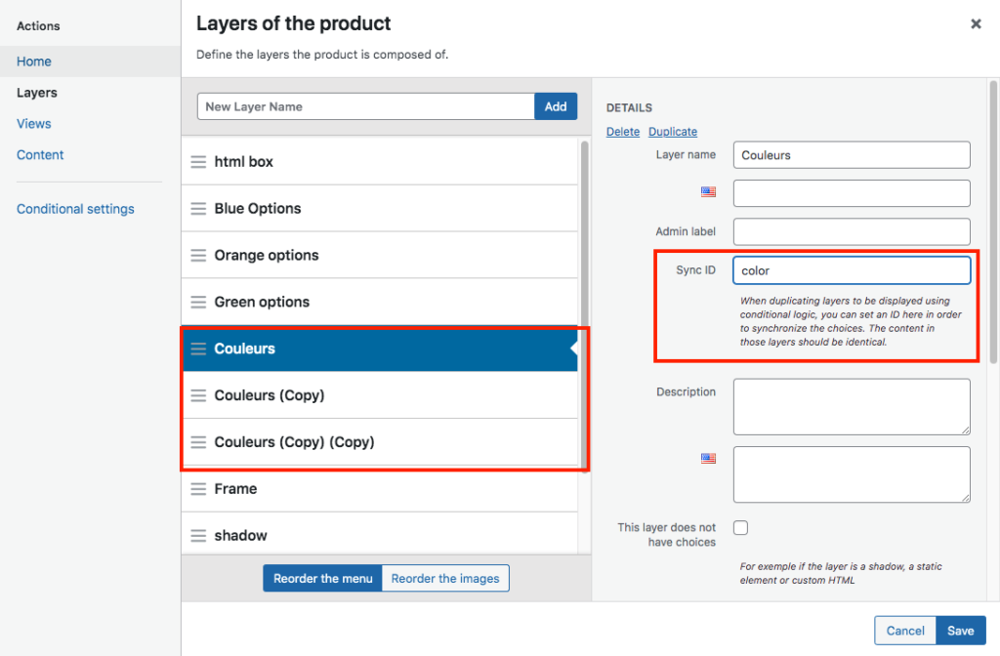

# Conditional Logic Add-on — Feature Documentation

> Reference documentation extracted from [WC Product Configurator](https://wc-product-configurator.com/docs/conditional-logic-add-on/) to guide our implementation.
>
> **Source pages:**
> - [Conditional Logic Add-on (overview)](https://wc-product-configurator.com/docs/conditional-logic-add-on/)
> - [Setting up conditions](https://wc-product-configurator.com/docs/conditional-logic-add-on/basic-condition/)
> - [Synchronising choices across layers](https://wc-product-configurator.com/docs/conditional-logic-add-on/synchronising-choices-across-layers/)

---

## Table of Contents

1. [Overview](#overview)
2. [Admin UI Navigation](#admin-ui-navigation)
3. [Adding a Condition](#adding-a-condition)
4. [Condition Structure](#condition-structure)
   - [The Toolbar](#1-the-toolbar)
   - [Condition Rules (IF)](#2-condition-rules-if-logic)
   - [Condition Actions (THEN)](#3-condition-actions-then-logic)
5. [Worked Example: Color-Dependent Layer Visibility](#worked-example-color-dependent-layer-visibility)
6. [Synchronising Choices Across Layers (Sync ID)](#synchronising-choices-across-layers-sync-id)
7. [Key Technical Notes](#key-technical-notes)
8. [Implementation Considerations for Our Plugin](#implementation-considerations-for-our-plugin)

---

## Overview

The Conditional Logic add-on brings powerful functionality to the product configurator, making it possible to create complex configurations where:

- Layers/choices are shown or hidden based on other selections
- Choices can be auto-selected or disabled dynamically
- Multiple layers can be synchronized to share the same selection
- Nested/chained conditions can create complex rule trees

For products with greater complexity, the original plugin suggests using the support form for guidance, as "usage may vary a lot depending on the product."

---

## Admin UI Navigation

The configurator's admin panel has a **left sidebar** with the following tabs:

- **Actions**
- **Home**
- **Layers** — manage product layers and their choices
- **Views** — manage product views (e.g., Front, Back)
- **Content**
- **Conditional settings** — where conditions are created and managed

The **Conditional settings** tab is where all conditional logic work happens. The **Layers** tab is where the **Sync ID** setting is configured.

---

## Adding a Condition

Navigate to the **Conditional settings** tab in the product editor sidebar. At the top, there is an input field with placeholder text `"Condition label..."` and a blue **Add** button.


> *The "Add condition" interface: type a label and click "Add" to create a new condition.*

The left panel shows a list of all conditions (sortable/reorderable with drag handles). Clicking a condition opens its details in the right panel.

---

## Condition Structure

Each condition is composed of **three core sections**:

### 1. The Toolbar


> *The toolbar shows: Condition name text field, Enabled checkbox, Make reversible checkbox, Always check checkbox, and Duplicate/Delete links.*

The toolbar sits at the top of each condition's detail panel and contains:

| Control | UI Element | Description |
|---------|-----------|-------------|
| **Condition name** | Text input (e.g., `"New Condition"`) | Free-text label to identify the condition |
| **Enabled** | Checkbox (checked by default) | Controls whether the condition is active |
| **Make reversible** | Checkbox (unchecked by default) | When enabled, the **opposite action** executes when the condition evaluates to FALSE. **Warning:** "Avoid using it if several conditions have actions affecting the same elements, as they would then potentially cancel each other." |
| **Always check** | Checkbox (unchecked by default) | By default, conditions only re-evaluate when the items referenced in the rules change. When enabled, "the condition will be checked at every run instead." Useful "when there is a dependency between conditions." |
| **Duplicate** | Text link (right side) | Creates a copy of the condition |
| **Delete** | Text link (right side, red) | Deletes the condition |

#### Make Reversible — Detailed Behavior

This is described as "a powerful feature":
- **Condition TRUE** → Performs the defined actions (e.g., Show layer X)
- **Condition FALSE** → Automatically performs the **opposite** actions (e.g., Hide layer X)

This eliminates the need to create separate conditions for the inverse behavior.

#### Always Check — When to Use

Default behavior: conditions only re-evaluate when the specific layer/choice referenced in the rules changes. With "Always Check" enabled, the condition re-evaluates on **every** user interaction. Use this when:
- Conditions depend on the results of other conditions
- Complex chained logic requires constant re-evaluation

---

### 2. Condition Rules (IF Logic)


> *The rules section reads: `IF [all v] OF THE FOLLOWING CONDITIONS ARE MET`. Each rule row has 3 dropdowns: trigger parent (e.g., "MAIN Leather Color"), trigger element (e.g., "303 SUN TANNED"), and state (e.g., "selected"). Blue `+` and `-` buttons on the right add/remove rule rows.*

#### Layout (as seen in screenshot)

```
IF [ all  v ] OF THE FOLLOWING CONDITIONS ARE MET

┌──────────────────────────┐ ┌──────────────────────┐     ┌───────────┐
│ MAIN Leather Color     v │ │ 303 SUN TANNED     v │ is  │ selected v│  [+] [-]
└──────────────────────────┘ └──────────────────────┘     └───────────┘

┌──────────────────────────┐ ┌──────────────────────┐     ┌───────────┐
│ --- Select an item --- v │ │                    v │ is  │ selected v│  [+] [-]
└──────────────────────────┘ └──────────────────────┘     └───────────┘
```

#### Comparison Operator

The first dropdown controls how rules combine:
- **all** (AND logic) — Every rule must be true for the condition to trigger
- **any** (OR logic) — At least one rule must be true

#### Individual Rule Structure

Each rule row has **3 dropdowns**:

**Dropdown 1 — Trigger Parent / Category:**

| Option | Description |
|--------|-------------|
| **Layer** (e.g., "MAIN Leather Color") | A configurator layer — shows layer name in dropdown |
| **View** | A configurator view |
| **Condition** | Another condition — enables nested/chained logic |

**Dropdown 2 — Trigger Element** (depends on parent):

| When Parent is... | Available Elements |
|---|---|
| **Layer** | A **specific choice** (e.g., "303 SUN TANNED"), **[ Any choice ]**, or **[ No choice ]** |
| **View** | List of available views |
| **Condition** | List of other defined conditions |

**Dropdown 3 — Element State:**

| State | Description | Notes |
|-------|-------------|-------|
| **selected** | The element is currently selected | **Preferred** — works when loading saved configs and editing from cart |
| **not selected** | The element is not currently selected | **Preferred** — same persistence benefits |
| **clicked** | The element was just clicked | **Avoid when possible** — "only triggers with the touch or mouse events", NOT when loading saved configurations |

> **Important:** "In most cases, you should check if an item **is selected** or **not selected**." These states persist across saved configurations and cart editing. "Clicked only triggers with the touch or mouse events."

> **Note on Views:** "Views should not generally be used in the rules, as they have limited interactivity." Their main use is enabling show/hide of views "that are only relevant for some selection."

Users can have **"as many rules as needed"** per condition (use the `+` button to add more).

---

### 3. Condition Actions (THEN Logic)


> *The actions section reads: `THEN PERFORM THE FOLLOWING ACTIONS:`. Each action row has 3 dropdowns: action type (e.g., "Show"), target type ("Layer"), and target element (e.g., "--- Select a layer ---"). Blue `+` and `-` buttons on the right add/remove action rows.*

#### Layout (as seen in screenshot)

```
THEN PERFORM THE FOLLOWING ACTIONS:

┌──────────────┐ ┌─────────┐ ┌──────────────────────────┐
│ Show       v │ │ Layer v │ │ --- Select a layer --- v │  [+] [-]
└──────────────┘ └─────────┘ └──────────────────────────┘

┌──────────────┐ ┌─────────┐ ┌──────────────────────────┐
│ Show       v │ │ Layer v │ │ --- Select a layer --- v │  [+] [-]
└──────────────┘ └─────────┘ └──────────────────────────┘
```

"You can trigger an **unlimited amount of actions**."

Each action row consists of:
- **Dropdown 1:** The action type
- **Dropdown 2:** The target type (e.g., "Layer")
- **Dropdown 3:** The specific target element

#### Full List of Available Actions

| Action | Description | Notes |
|--------|-------------|-------|
| **Show** | Makes an element visible in the configurator | Element becomes fully active (priced, selectable, visible) |
| **Hide** | Hides an element completely | "Hidden elements are **disabled and ignored completely**" — no pricing, no validation, no display |
| **Select** | Automatically selects a specific choice | |
| **Deselect** | Deselects a choice | "Only works for **Multiple choice** layers, where the user can select and deselect items" |
| **Disable** | Element remains visible but **cannot be selected** | "Still visible, but cannot be selected" — grayed out appearance |
| **Enable** | Re-enables a previously disabled element | Reverses a Disable action |
| **Reset layer** | Reverts layer to default choice or none | "Resets to the default choice, or none, depending on the selection settings" |
| **Open layer on click** | Opens a specified layer when user clicks | |
| **Sync with layer** | Synchronizes two layers | "Layers need to have the same number of choices, and they should be in the same order." For permanent sync, use Sync ID setting instead |
| **Show layer in menu** | Shows a previously hidden layer in the navigation menu | |
| **Hide layer in menu** | Hides layer from menu **only** | "The layer is still active, the images shown in the viewer, the prices counted and the selection valid" |
| **Save result to use in other condition** | *(NEW)* Stores condition result for reuse | "For reusable / nested conditions. Allows making complex rules where 'Any' and 'All' need to be combined" |

#### Hide vs. Hide Layer in Menu

| Aspect | Hide | Hide Layer in Menu |
|--------|------|--------------------|
| Visible in viewer | No | Yes |
| Images displayed | No | Yes |
| Prices counted | No | Yes |
| Selection valid | No | Yes |
| Appears in menu | No | No |
| Element state | Completely disabled/ignored | Fully active, just not in menu |

---

## Worked Example: Color-Dependent Layer Visibility

### Scenario

A product has a "Cercle" (Circle) layer with 3 color choices, and each color has its own separate options layer. When a color is selected, only the matching options layer should be visible.

### Layers Panel Setup


> *The Layers panel showing the product structure. Left side: list of layers — "Cercle" (with a circle icon), "Blue circle options" (selected/highlighted in blue), "Green circle options", "Orange circle options", "Frame", "shadow", "Text overlay". Bottom buttons: "Reorder the menu" and "Reorder the images". Right side: DETAILS panel for the selected layer showing Layer name: "Couleurs", Admin label: "Blue circle options", Sync ID: "color", Description field. The three color options layers are highlighted with a red dashed border to show they're the conditional layers.*

Key observations from this screenshot:
- The **"Cercle"** layer has a circle icon (indicating it has visual choices)
- The three options layers (**Blue/Green/Orange circle options**) are separate layers
- Each options layer has **Layer name** "Couleurs" (same name for sync purposes)
- The **Sync ID** is set to `"color"` — enabling synchronization between the Couleurs layers
- The **Admin label** distinguishes them in the admin (e.g., "Blue circle options")

### Conditional Settings Setup


> *The Conditional settings panel. Left side: list of conditions — "asd", "not-s", "Blue options" (selected/highlighted in blue), "Colors 2", "Colors 3". At the top: "Condition label..." input with "Add" button. Right side: Condition details — Condition name: "Blue options", Enabled: checked, Make reversible: checked, Delete link (red). Rule: `IF [all v] OF THE FOLLOWING CONDITIONS ARE MET` → `Cercle > Bleu` is `selected` (with `+` button). Action: `THEN PERFORM THE FOLLOWING ACTIONS:` → `Show` | `Blue circle options` (with `+` button). Bottom: Cancel and Save buttons.*

### Setup Pattern (One condition per color)

#### Condition: "Blue options"
```
TOOLBAR:
  Condition name: "Blue options"
  Enabled: ✓
  Make reversible: ✓    ← Key setting!

IF [all] OF THE FOLLOWING CONDITIONS ARE MET:
  Cercle > Bleu    is    selected

THEN PERFORM THE FOLLOWING ACTIONS:
  Show    Blue circle options
```

#### Condition: "Colors 2" (Green)
```
TOOLBAR:
  Condition name: "Colors 2"
  Enabled: ✓
  Make reversible: ✓

IF [all] OF THE FOLLOWING CONDITIONS ARE MET:
  Cercle > Vert    is    selected

THEN PERFORM THE FOLLOWING ACTIONS:
  Show    Green circle options
```

#### Condition: "Colors 3" (Orange)
```
TOOLBAR:
  Condition name: "Colors 3"
  Enabled: ✓
  Make reversible: ✓

IF [all] OF THE FOLLOWING CONDITIONS ARE MET:
  Cercle > Orange    is    selected

THEN PERFORM THE FOLLOWING ACTIONS:
  Show    Orange circle options
```

### How It Works

1. User selects "Bleu" in the Cercle layer
2. "Blue options" condition evaluates **TRUE** → **Shows** Blue circle options layer
3. "Colors 2" condition evaluates **FALSE** → **Hides** Green circle options (reversible kicks in)
4. "Colors 3" condition evaluates **FALSE** → **Hides** Orange circle options (reversible kicks in)

The **Make Reversible** setting eliminates the need for explicit Hide actions — "the opposite effect" automatically happens when a condition is false. Since each color follows the same pattern, "only the appropriate option will be shown when a color is selected."

---

## Synchronising Choices Across Layers (Sync ID)

### Overview

"It is possible to synchronise choices across several layers." This feature links selections so that choosing an option in one layer automatically mirrors that choice in all other synced layers.

### Use Cases

1. **Duplicated layers with conditional visibility** — When a layer is duplicated and only one copy displays at a time based on another selection
2. **Shared attributes across layers** — e.g., "when several layers share the same colour," ensuring a single color pick propagates uniformly

### Requirements

Two strict conditions must be met:

1. **"Each synchronised layer must have the same amount of choices"**
2. **"Each associate choice must be at the same position in the list"**

Matching is **positional**: choice #1 in one synced layer maps to choice #1 in all others, choice #2 to choice #2, etc.

### Instructions

> "Go to the layers panel, and in the **Sync ID** setting field, add an identifier, which will be common between your synched layers."

### Layers Panel with Sync ID


> *The Layers panel. Left side: list of layers — "html box", "Blue Options", "Orange options", "Green options", "Couleurs" (selected/highlighted in blue), "Couleurs (Copy)", "Couleurs (Copy) (Copy)", "Frame", "shadow". The three "Couleurs" layers are highlighted with a red dashed border. Right side: DETAILS panel showing — Layer name: "Couleurs", Admin label (empty), **Sync ID: "color"** (highlighted with red box), with help text: "When duplicating layers to be displayed using conditional logic, you can set an ID here in order to synchronize the choices. The content in those layers should be identical." Below: Description field, US flag icon (for translations), and "This layer does not have choices" checkbox. Bottom: Cancel and Save buttons.*

### Key Observations from Screenshot

- The **Sync ID** field is a simple text input in the layer DETAILS panel
- The help text reads: *"When duplicating layers to be displayed using conditional logic, you can set an ID here in order to synchronize the choices. The content in those layers should be identical."*
- Three "Couleurs" layers (original + 2 copies) all share the same Sync ID `"color"`
- The "This layer does not have choices" checkbox is visible — for static/decorative layers

### Configuration Summary

| Setting | Detail |
|---------|--------|
| **Admin Location** | Layers panel → Layer DETAILS |
| **Field Name** | Sync ID |
| **Input Type** | Free-form text string (e.g., `"color"`) |
| **Matching Mechanism** | Positional — choices paired by list order |
| **Scope** | All layers sharing the identical Sync ID value |
| **Help Text** | "When duplicating layers to be displayed using conditional logic, you can set an ID here in order to synchronize the choices. The content in those layers should be identical." |

### Sync with Layer (Action) vs. Sync ID (Setting)

| Aspect | Sync with Layer (Action) | Sync ID (Setting) |
|--------|--------------------------|---------------------|
| Type | Condition action (in THEN section) | Layer setting (in DETAILS panel) |
| Trigger | Only when condition evaluates to TRUE | Always active |
| Permanence | Conditional / temporary | Permanent |
| Use case | One-time sync on specific trigger | Always-on synchronization |

---

## Key Technical Notes

1. **Conditions can reference other conditions** as triggers (in the rules dropdown), enabling chained/nested logic
2. **"Save result" action** enables combining `Any` and `All` operators in complex rule trees
3. **Selection-based state checks** (`is selected` / `is not selected`) persist across saved configurations and cart edits; **click-based checks do not** — "Clicked only triggers with the touch or mouse events"
4. **Hide completely removes** an element from all consideration (pricing, validation, display)
5. **Hide layer in menu** only affects menu visibility — the layer remains fully active
6. **Sync with layer** action requires matching choice counts and ordering between layers
7. **Sync ID** is the preferred method for permanent layer synchronization
8. **Make Reversible** should be avoided when multiple conditions target the same elements, as "they would then potentially cancel each other"
9. **Views** have "limited interactivity" and should not generally be used in rules

---

## Implementation Considerations for Our Plugin

### Data Model Requirements

#### Conditions (per product)
```
condition:
  id: int
  product_id: int
  name: string              # Label (e.g., "Blue options")
  enabled: boolean          # Default: true
  reversible: boolean       # "Make reversible" — default: false
  always_check: boolean     # "Always check" — default: false
  comparison: "all" | "any" # AND/OR for rules
  sort_order: int           # Position in conditions list
```

#### Rules (per condition)
```
rule:
  id: int
  condition_id: int
  trigger_type: "layer" | "view" | "condition"
  trigger_parent_id: int    # Layer ID, View ID, or Condition ID
  trigger_element: string   # Choice ID, "any", "none"
  element_state: "selected" | "not_selected" | "clicked"
  sort_order: int
```

#### Actions (per condition)
```
action:
  id: int
  condition_id: int
  action_type: "show" | "hide" | "select" | "deselect" | "disable" | "enable"
               | "reset_layer" | "open_layer" | "sync_with_layer"
               | "show_in_menu" | "hide_in_menu" | "save_result"
  target_type: "layer" | "choice"    # As seen in screenshot: "Layer" dropdown
  target_element_id: int             # Specific layer or choice ID
  sort_order: int
```

#### Sync ID (per layer)
```
layer_setting:
  sync_id: string | null    # Free-form text, e.g., "color"
```

### Admin UI Components Needed

Based on the screenshots, the admin interface consists of:

1. **Conditional settings tab** — in the left sidebar (alongside Actions, Home, Layers, Views, Content)
2. **Condition list** — left panel with sortable/draggable list of conditions, each with a drag handle (`≡`) icon
3. **Add condition bar** — input field (`"Condition label..."`) + blue `"Add"` button at top
4. **Condition detail panel** — right panel showing:
   - **Toolbar row**: Condition name input | Enabled checkbox | Make reversible checkbox | Always check checkbox | Duplicate link | Delete link (red)
   - **Rules section**: `"IF [all/any v] OF THE FOLLOWING CONDITIONS ARE MET"` heading, then rows of 3 dropdowns + `[+]` `[-]` buttons
   - **Actions section**: `"THEN PERFORM THE FOLLOWING ACTIONS:"` heading, then rows of 3 dropdowns + `[+]` `[-]` buttons
5. **Cancel / Save buttons** — bottom right of detail panel
6. **Sync ID field** — in the Layers tab → Layer DETAILS panel, with help text

### Frontend (JavaScript) Evaluation Engine

```
User interacts with configurator (clicks a choice, changes a layer)
  ↓
For each enabled condition (in sort order):
  ↓
  Should this condition run?
    - If "always_check": YES, always evaluate
    - Otherwise: only if the changed element is referenced in this condition's rules
  ↓
  Evaluate rules:
    - For each rule: check trigger element's current state
    - Combine results with comparison operator (all = AND, any = OR)
  ↓
  If result is TRUE:
    → Execute all actions in order
  If result is FALSE AND condition is reversible:
    → Execute the OPPOSITE of each action
  ↓
  If any action is "save_result":
    → Store this condition's result for other conditions to reference
  ↓
Repeat for next condition
```

### Action Opposites (for Reversible)

| Action | Opposite |
|--------|----------|
| Show | Hide |
| Hide | Show |
| Select | Deselect |
| Deselect | Select |
| Disable | Enable |
| Enable | Disable |
| Show layer in menu | Hide layer in menu |
| Hide layer in menu | Show layer in menu |

### Priority / Execution Order

Conditions must be evaluated in a defined order (by `sort_order`) since:
- Conditions can reference other conditions as rule triggers
- "Save result" actions feed into subsequent condition evaluations
- Conflicting actions on the same element need deterministic resolution
- "Always check" conditions may depend on other conditions completing first

---

## Screenshots Reference

All screenshots are saved in `docs/images/`:

| File | Description |
|------|-------------|
| `01-add-condition.png` | Add condition input field + Add button |
| `02-toolbar.png` | Condition toolbar (name, enabled, reversible, always check, duplicate, delete) |
| `03-condition-rules.png` | Rules section (IF all/any, rule rows with 3 dropdowns, +/- buttons) |
| `04-condition-actions.png` | Actions section (THEN, action rows with 3 dropdowns, +/- buttons) |
| `05-cercle-example-frontend.png` | Layers panel with Cercle example — shows layer list + DETAILS with Sync ID |
| `06-cercle-example-condition.png` | Conditional settings panel with "Blue options" condition fully configured |
| `07-sync-id-layers.png` | Layers panel showing Sync ID field with "color" value on duplicated Couleurs layers |

### Original Image URLs

| File | Source URL |
|------|-----------|
| `01-add-condition.png` | `https://wc-product-configurator.com/wp-content/uploads/2021/04/image-3.png` |
| `02-toolbar.png` | `https://wc-product-configurator.com/wp-content/uploads/2021/04/image-4.png` |
| `03-condition-rules.png` | `https://wc-product-configurator.com/wp-content/uploads/2021/04/image-5.png` |
| `04-condition-actions.png` | `https://wc-product-configurator.com/wp-content/uploads/2021/04/image-6.png` |
| `05-cercle-example-frontend.png` | `https://wc-product-configurator.com/wp-content/uploads/2021/04/screenshot-conditional-logic-2-1024x540.png` |
| `06-cercle-example-condition.png` | `https://wc-product-configurator.com/wp-content/uploads/2021/04/screenshot-conditional-logic-3-1024x516.png` |
| `07-sync-id-layers.png` | `https://wc-product-configurator.com/wp-content/uploads/2021/04/screensho-sync-01-1024x672.png` |
